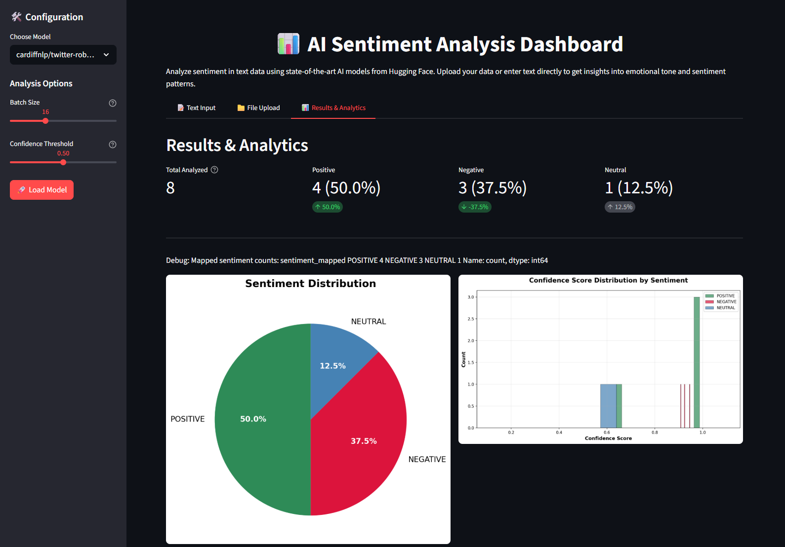
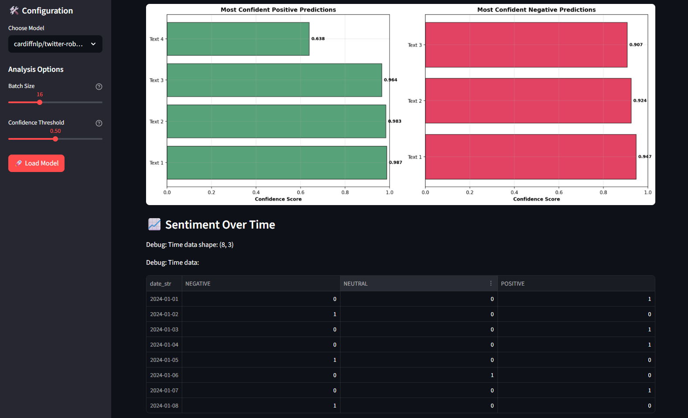
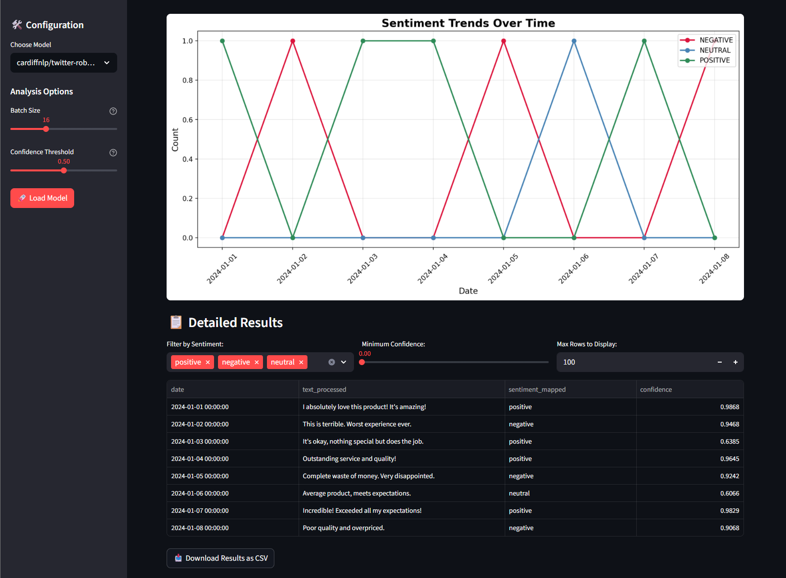

📊 AI Sentiment Analysis Dashboard

🚀 Overview

The AI Sentiment Analysis Dashboard is an interactive web application built with Streamlit that analyzes textual data and classifies sentiment into positive, negative, or neutral.

It leverages Natural Language Processing (NLP) techniques to transform unstructured text into meaningful insights, helping users quickly understand opinions, emotions, and trends.

✨ Features

🧠 Real-time Sentiment Analysis

Input text and instantly receive sentiment classification

📊 Interactive Visualizations

Charts and graphs for sentiment distribution and trends

📁 Batch Processing

Upload datasets (e.g., CSV/Excel) for bulk sentiment analysis

🔍 Data Exploration

Filter and analyze results based on sentiment scores

⚡ Fast & Lightweight UI

Powered by Streamlit for seamless interactivity

🛠️ Tech Stack

Frontend / App Framework: Streamlit

Language: Python

Libraries:

Pandas (data processing)

NLP models (e.g., TextBlob / Transformers / OpenAI)

Plotly / Matplotlib (visualizations)

Streamlit enables rapid development of interactive data apps directly from Python scripts without needing traditional frontend development.

📌 How It Works

Input Data

User enters text or uploads a dataset

Processing

NLP model evaluates the emotional tone of the text

Classification

Output is categorized as:

Positive 😊

Negative 😡

Neutral 😐

Visualization

Results are displayed through interactive charts and summaries

🧑‍💻 Installation & Setup

# Clone the repository

git clone <your-repo-url>

# Navigate to project directory

cd sentiment-analysis-dashboard

# Install dependencies

pip install -r requirements.txt

# Run the app

streamlit run app.py

🎯 Use Cases

📢 Customer feedback analysis

🛍️ Product review insights

📰 News sentiment tracking

📱 Social media monitoring

📸 Screenshots

⚠️ Limitations

Accuracy depends on the underlying NLP model

Contextual nuances (sarcasm, slang) may affect predictions

Large datasets may require optimization

🔮 Future Improvements

Multi-language support

Advanced models (LLMs / fine-tuned transformers)

Real-time API integrations (Twitter, news feeds)

Exportable reports
